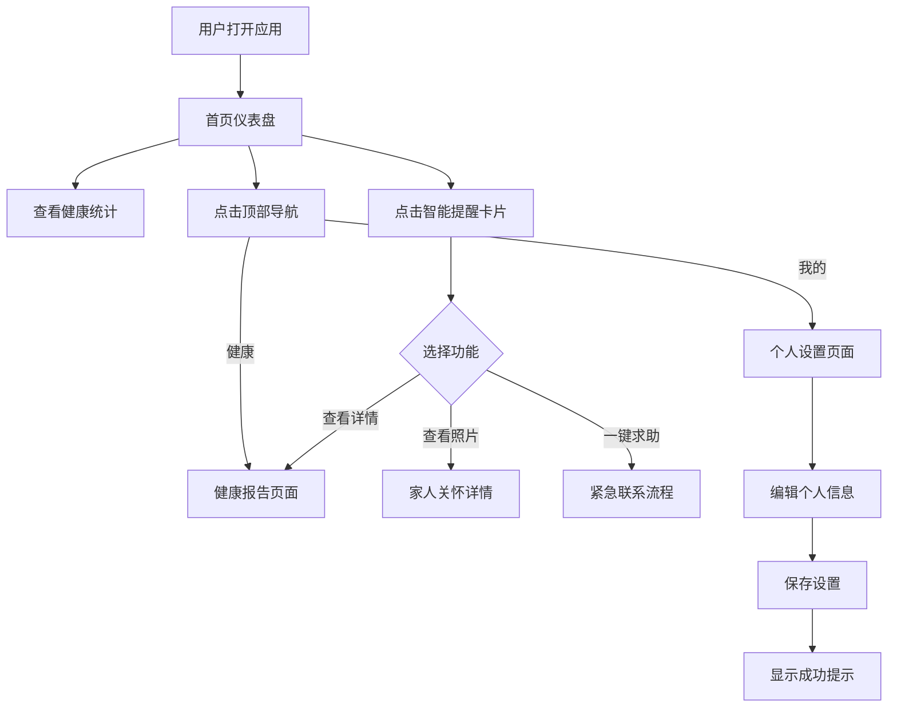

## 1. 产品概述

**颐年智伴**是一款面向银发群体的智能康养移动应用，以温暖、清晰、无障碍为核心设计理念。产品旨在通过智能健康提醒、家人关怀互动和紧急求助功能，为老年用户提供日常健康管理和情感支持。

- **目标用户**: 60岁以上银发群体，对触控操作和阅读小字可能有困难的用户
- **核心价值**: 温暖守护每一天，让科技陪伴银发生活，传达信任感和安全感
- **设计定位**: 智能伴侣而非工具，语气亲切但不居高临下，简洁但不冷淡

## 2. 核心功能

### 2.1 用户角色

| 角色 | 注册方式 | 核心权限 |
|------|----------|----------|
| 老年用户 | 手机号注册 | 查看健康数据、接收提醒、家人互动、紧急求助 |
| 家属用户 | 手机号注册 | 查看长辈健康状态、发送关怀消息、接收紧急通知 |

### 2.2 功能模块

1. **首页仪表盘**: 健康数据概览、智能提醒、今日天气、快捷操作
2. **健康报告**: 血压监测、用药记录、睡眠质量、血糖检测、运动步数、体温记录
3. **个人设置**: 个人信息管理、用药提醒设置、紧急联系人配置

### 2.3 页面详情

| 页面名称 | 模块名称 | 功能描述 |
|----------|----------|----------|
| 首页仪表盘 | Hero区域 | 品牌展示、核心价值传达、快速入口按钮 |
| 首页仪表盘 | 统计面板 | 睡眠时长、今日步数、血压数据、体温数据实时展示 |
| 首页仪表盘 | 智能提醒卡片 | 待处理提醒、健康日报、家人关怀、一键求助四个核心功能入口 |
| 健康报告 | 天气卡片 | 今日天气、气温范围、户外活动建议 |
| 健康报告 | 健康指标列表 | 血压、用药、睡眠、血糖、运动、体温六大健康指标状态展示 |
| 健康报告 | 操作按钮 | 导出报告（禁用状态示例）、分享给家人 |
| 个人设置 | 表单区域 | 姓名、年龄、手机号、紧急联系人、用药提醒时间、地址等个人信息编辑 |
| 个人设置 | 模态弹窗 | 设置保存成功提示示例 |

## 3. 核心流程

用户打开应用后，首先看到首页仪表盘，展示今日健康概览和待处理提醒。用户可以：
- 点击"查看详情"进入健康报告页面，查看各项健康指标详情
- 点击"查看照片"查看家人发送的关怀内容
- 点击"一键求助"触发紧急联系流程
- 通过顶部导航切换到"我的"页面进行个人设置

## 4. 用户界面设计

### 4.1 设计风格

- **主色**: Teal (#2e8b7b) — 沉稳温和的蓝绿色，传达信任感和安全感
- **次级色**: Warm (#d4956a) — 温暖的琥珀/陶土色，作为点缀和强调
- **语义色**: Success (#3ba94f)、Warning (#e8940a)、Error (#dc3545)、Info (#2b7cc8)
- **背景色**: Warm off-white (#faf8f5)，远离冷灰的现代感
- **圆角**: 8px(sm) / 10px(md) / 12px(lg) / 16px(xl)，整体温和但不过于圆润
- **字体**: Lora衬线体(标题) + Noto Sans SC无衬线(正文)，清晰易读
- **字号**: 比常规更大，正文18px、标题40px，服务于可读性
- **触控区域**: 最小44px，大按钮52px，为手部震颤用户提供更大命中区域
- **阴影**: 5级阴影系统，透明度极其克制，若有若无的层次感

### 4.2 页面设计概览

| 页面名称 | 模块名称 | UI元素 |
|----------|----------|--------|
| 首页仪表盘 | Hero区域 | Teal背景、大标题56px Lora字体、白色CTA按钮、居中布局 |
| 馀页仪表盘 | 统计面板 | 4列网格、tabular-nums数字、底部边框分隔、响应式折叠 |
| 首页仪表盘 | 提醒卡片网格 | 2列网格、卡片带图标行、状态标签、hover亮度变化而非阴影 |
| 健康报告 | 天气卡片 | Primary-container背景、带边框、天气图标、气温描述 |
| 健康报告 | 健康指标列表 | 单列列表、每行40px圆形图标、flex布局、状态标签胶囊形 |
| 个人设置 | 表单区域 | 48px高度输入框、1.5px边框、聚焦3px teal glow、错误状态红色提示 |

### 4.3 响应式设计

- **桌面优先**: 主要设计基准为桌面视图
- **移动适配**: 900px以下卡片网格单列，640px以下统计面板折叠、导航可滚动
- **触控优化**: 所有交互元素满足44px最小触控目标，大按钮52px
- **字号放大**: 正文18px、标题层级40/32/24px，确保老年用户阅读舒适

### 4.4 动效与过渡

- **过渡时长**: 统一0.15s，避免过快闪烁或过慢延迟
- **状态变化**: 限制在background、border-color、opacity、filter属性
- **hover效果**: 使用brightness而非颜色切换，产生微妙按压感
- **避免复杂动画**: 不使用transform或复杂keyframe，保持克制