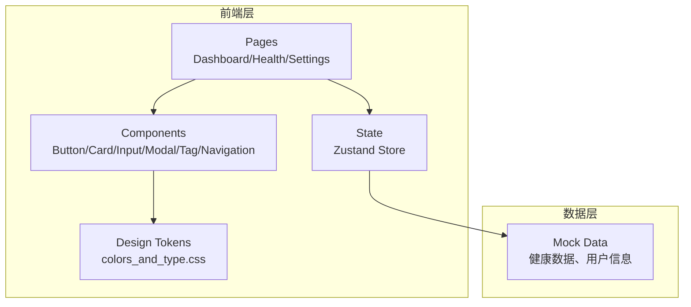

## 1. 架构设计



## 2. 技术栈说明

- **前端框架**: React@18 + TypeScript
- **样式方案**: Tailwind CSS@3 + 自定义设计系统tokens
- **构建工具**: Vite
- **状态管理**: Zustand（轻量级、适合小型应用）
- **图标库**: Lucide React
- **字体加载**: Google Fonts CDN (Lora + Noto Sans SC)
- **后端**: 无（纯前端演示项目）
- **数据**: Mock数据，模拟健康指标和用户信息

## 3. 路由定义

| 路由 | 目的 | 页面组件 |
|------|------|----------|
| `/` | 首页仪表盘，展示健康概览和智能提醒 | Dashboard |
| `/health` | 健康报告页面，展示详细健康指标 | HealthReport |
| `/settings` | 个人设置页面，编辑个人信息 | Settings |

## 4. 组件架构

### 4.1 设计系统组件

| 组件名称 | 文件路径 | 功能描述 |
|----------|----------|----------|
| Button | `src/components/Button.tsx` | 4种变体(primary/secondary/outline/ghost)、3种尺寸(sm/md/lg) |
| Card | `src/components/Card.tsx` | 3种变体(default/elevated/outlined)、图标行、标题、描述、操作按钮 |
| Input | `src/components/Input.tsx` | 48px高度、1.5px边框、聚焦环、错误状态、辅助文本 |
| Navigation | `src/components/Navigation.tsx` | 顶部导航栏、底部导航栏、active状态指示器 |
| Modal | `src/components/Modal.tsx` | 半透明遮罩、图标区域、标题、消息、确认/取消按钮 |
| Tag | `src/components/Tag.tsx` | 4种变体(default/success/warning/error)、胶囊形态、2种尺寸 |

### 4.2 页面组件

| 组件名称 | 文件路径 | 功能描述 |
|----------|----------|----------|
| Dashboard | `src/pages/Dashboard.tsx` | Hero区域、统计面板、智能提醒卡片网格、底部导航 |
| HealthReport | `src/pages/HealthReport.tsx` | 天气卡片、健康指标列表、操作按钮组 |
| Settings | `src/pages/Settings.tsx` | 个人信息表单、模态弹窗示例 |

### 4.3 布局组件

| 组件名称 | 文件路径 | 功能描述 |
|----------|----------|----------|
| Layout | `src/components/Layout.tsx` | 应用外壳、顶部导航、主内容区、底部Footer |
| AppShell | `src/components/AppShell.tsx` | 页面切换导航、内容容器 |

## 5. 数据模型

### 5.1 健康数据模型

```typescript
interface HealthReminder {
  title: string;
  desc: string;
  icon: string;
  tag: string;
  tagClass: 'tag--success' | 'tag--warning' | 'tag--error' | 'tag--default';
}

interface HealthItem {
  title: string;
  desc: string;
  icon: string;
  status: string;
  statusClass: 'tag--success' | 'tag--warning' | 'tag--error';
}

interface HealthStats {
  sleepHours: number;
  steps: number;
  bloodPressure: string;
  temperature: number;
}

interface UserProfile {
  name: string;
  age: number;
  phone: string;
  emergencyContact: string;
  medicationTimes: string[];
  address: string;
}
```

### 5.2 Mock数据示例

健康提醒数据:
- 智能提醒: 下午三点服用降压药，待处理
- 健康日报: 今日步数4,200步，正常
- 家人关怀: 女儿发送了本周照片，新消息
- 一键求助: 紧急联系人已就绪，已就绪

健康指标数据:
- 血压监测: 128/82 mmHg，状态平稳，正常
- 用药记录: 上午降压药已按时服用，已完成
- 睡眠质量: 深睡4.2小时，总时长7.1小时，良好
- 血糖检测: 空腹血糖6.1 mmol/L，偏高
- 运动步数: 目标6,000步，已完成4,200步，进行中
- 体温记录: 36.5°C，正常

## 6. 目录结构

```
src/
├── components/           # 设计系统组件
│   ├── Button.tsx
│   ├── Card.tsx
│   ├── Input.tsx
│   ├── Modal.tsx
│   ├── Navigation.tsx
│   ├── Tag.tsx
│   └── Layout.tsx
├── pages/                # 页面组件
│   ├── Dashboard.tsx
│   ├── HealthReport.tsx
│   └── Settings.tsx
├── hooks/                # 自定义hooks
├── utils/                # 工具函数
├── store/                # Zustand状态管理
│   └── useAppStore.ts
├── data/                 # Mock数据
│   └── mockData.ts
├── styles/               # 自定义样式
│   └── design-tokens.css # 设计系统tokens
├── App.tsx               # 应用入口
├── main.tsx              # Vite入口
└── router.tsx            # 路由配置
```

## 7. 性能与可访问性

### 7.1 性能优化
- 使用Vite快速构建和HMR
- 组件懒加载（路由级别）
- 字体预加载
- CSS变量复用减少样式计算

### 7.2 可访问性
- 所有交互元素满足44px最小触控目标
- 高对比度配色（WCAG AA标准）
- 语义化HTML结构
- 键盘导航支持
- 焦点环明显可见

## 8. 开发计划

1. 初始化React + TypeScript + Vite + Tailwind项目
2. 配置设计系统CSS tokens
3. 开发6个核心组件
4. 实现页面组件和路由
5. 集成Mock数据和状态管理
6. 测试和优化