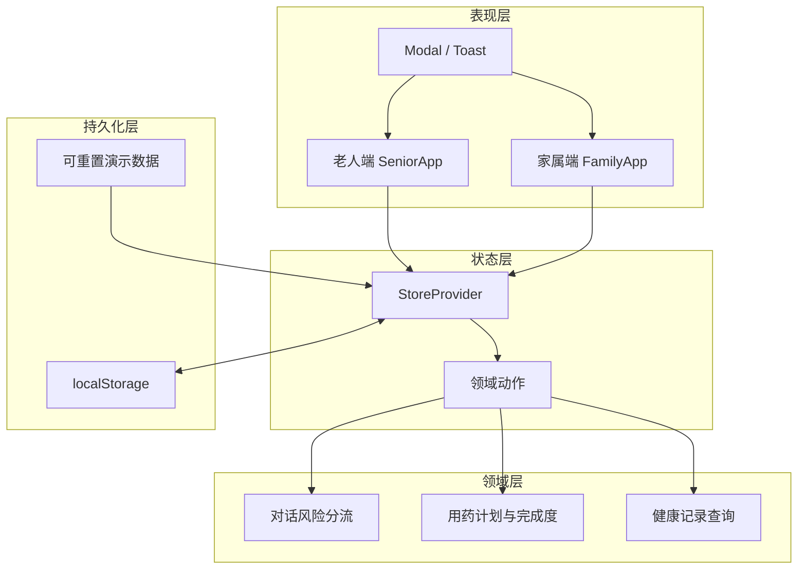

# 颐年智伴 Demo 技术架构

## 1. 当前版本定位

当前仓库是用于验证老人端与家属端关键闭环的纯前端 MVP。它优先验证交互、信息层级、适老化可用性和医疗安全边界，不包含真实账号、后端通知或模型服务。

## 2. 系统结构

## 3. 前端技术栈

- React 19 + TypeScript 7
- Vite 8
- Lucide React
- React Context + `useState` / `useMemo`
- Vitest
- 原生 CSS 设计系统与响应式断点

## 4. 核心模块

| 模块 | 文件 | 职责 |
| --- | --- | --- |
| 应用外壳 | `src/App.tsx` | 双角色切换、全局反馈、视图装配 |
| 老人端 | `src/views/SeniorApp.tsx` | 用药、健康、陪伴、家人留言和求助 |
| 家属端 | `src/views/FamilyApp.tsx` | 安心总览、用药配置、事件和家庭设置 |
| 共享状态 | `src/store.tsx` | 跨端动作、本地持久化、演示重置 |
| 领域逻辑 | `src/domain.ts` | 风险分流、进度计算和记录查询 |
| 数据模型 | `src/types.ts` | 用药、健康、事件、留言和联系人类型 |
| 演示数据 | `src/data.ts` | 默认家庭与照护记录 |
| 设计系统 | `src/styles.css` | 颜色、字号、组件状态和响应式布局 |

## 5. 安全策略

对话输入先进行规则化风险识别：

1. 急症关键词进入紧急求助确认。
2. 调药、停药和剂量问题拒绝给出医疗决策。
3. 普通健康不适只提供观察、记录和联系家人或医生的建议。
4. 紧急流程与普通陪伴对话在界面层隔离，避免多层弹窗和误操作。

这些规则仅用于 MVP 演示。生产环境需要服务端策略、模型安全网关、审计日志、人工复核和内容安全评测。

## 6. 生产化演进

建议按以下边界拆分服务：

- 身份与家庭关系服务
- 提醒与任务调度服务
- 通知编排服务（电话、短信、Push）
- 健康记录服务
- 紧急事件与人工工单服务
- AI 编排与安全策略服务
- 审计、监控和告警平台

所有外部动作需要具备幂等、重试、降级、超时和人工接管能力。健康、定位和语音数据需要单独授权、最小化采集、加密存储和可撤回机制。
