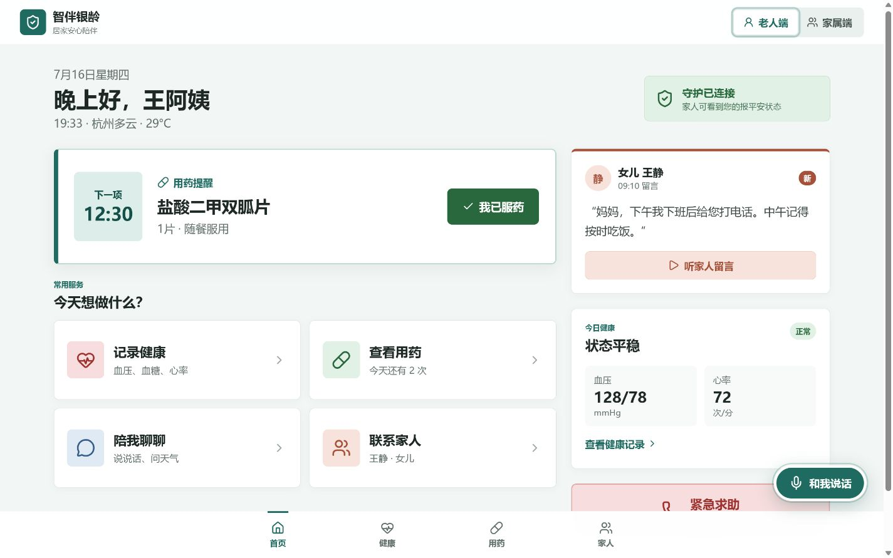
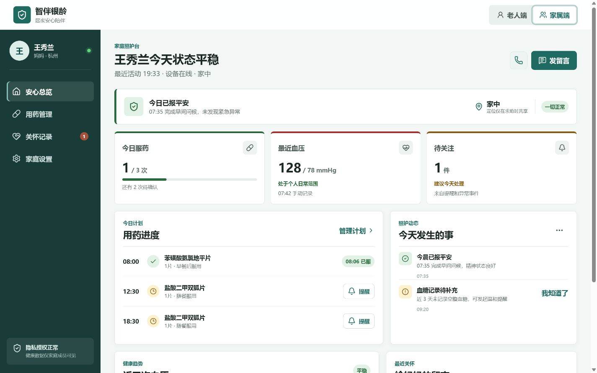
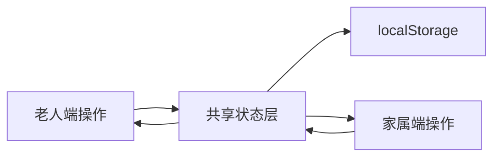

# 颐年智伴 Demo

> 智伴银龄双端 MVP：面向居家养老家庭的健康记录、用药提醒、紧急求助与日常陪伴应用。

[](https://github.com/cwx127/yinian-zhiban-Demo/actions/workflows/ci.yml)


这是根据产品 PRD 实现的响应式 Web MVP，包含老人端和家属端两个完整视角。产品强调大字、低学习成本、清晰反馈与医疗安全边界，并通过同一份本地数据演示家庭照护闭环。

## 产品预览

### 老人端



### 家属端



## 核心能力

| 角色 | 能力 | 已实现的交互 |
| --- | --- | --- |
| 老人端 | 今日用药 | 展示下一次用药、确认服药、查看全天计划 |
| 老人端 | 健康记录 | 记录血压、血糖和心率，查看最近记录 |
| 老人端 | 日常陪伴 | 文字对话、快捷问题、家人留言朗读 |
| 老人端 | 紧急求助 | 长按 3 秒、防误触确认、联系人顺序提示 |
| 家属端 | 安心总览 | 报平安、设备状态、健康摘要和待关注事件 |
| 家属端 | 用药管理 | 查看服药进度、发送提醒、添加或暂停计划 |
| 家属端 | 家庭关怀 | 发送留言、查看播放状态、确认异常事件 |
| 家属端 | 安全设置 | 紧急联系人顺序、隐私授权状态、演示数据重置 |

## 安全边界

项目内置了简单但明确的对话风险分流：

- 急症关键词会进入求助确认流程。
- 普通健康不适仅提供记录、观察和联系家人或医生的建议。
- 调药、停药、换药和剂量问题会明确拒绝给出医疗决策。
- 页面统一使用“健康记录、风险提醒、照护辅助”，不宣称诊断或治疗能力。
- 定位仅在求助流程中展示为共享，语音原文件不作为长期存储内容。

## 技术栈

- React 19 + TypeScript 7
- Vite 8
- Lucide React 图标系统
- React Context + 本地持久化状态
- Vitest 领域逻辑测试
- GitHub Actions 持续集成

## 快速开始

环境要求：Node.js 22.12 或更高版本，npm 10 或更高版本。

```bash
git clone https://github.com/cwx127/yinian-zhiban-Demo.git
cd yinian-zhiban-Demo
npm ci
npm run dev
```

开发服务默认运行在 `http://127.0.0.1:4173/`。

## 常用命令

```bash
npm run dev        # 启动开发服务
npm run test       # 执行领域逻辑测试
npm run test:watch # 监听模式运行测试
npm run build      # TypeScript 检查并生成生产构建
npm run preview    # 本地预览生产构建
npm run check      # 依次执行测试和生产构建
```

## 工程结构

```text
.
├─ .github/workflows/ci.yml   # 持续集成
├─ .trae/documents/           # 产品与技术文档
├─ docs/screenshots/          # README 演示截图
├─ src/
│  ├─ components/             # 通用弹窗与反馈组件
│  ├─ views/                  # 老人端与家属端页面
│  ├─ data.ts                 # 可重置的演示数据
│  ├─ domain.ts               # 风险分流、用药进度等领域逻辑
│  ├─ store.tsx               # 本地持久化状态与跨端动作
│  └─ styles.css              # 设计系统与响应式样式
├─ index.html
└─ package.json
```

## 数据流

老人端和家属端在演示环境中共享 React 状态，变更自动写入 `localStorage`：



该设计用于快速验证交互和跨端闭环，不等同于生产环境的数据架构。

## 当前边界与下一步

当前版本是可交互前端 MVP，以下能力仍为流程模拟：

- 真实电话、短信、Push 与紧急联系人轮询
- 实时定位和授权管理
- ASR、TTS 与大语言模型服务
- 账号、家庭绑定和服务端权限
- 加密存储、审计日志、监控与人工兜底

进入家庭试点前，需要接入具备幂等、重试、降级、审计和人工接管能力的后端服务，并完成个人信息保护与医疗合规评估。

## 免责声明

本项目用于产品验证和交互演示，不构成医疗诊断、治疗或用药建议，也不能替代医生、急救机构或专业照护人员。
